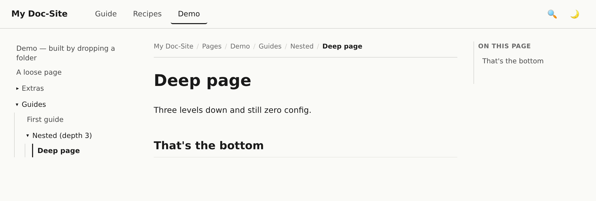

<h1 align="center">htmlkb</h1>

<p align="center">
  <strong>A zero-dependency static HTML doc-site for knowledge bases you build yourself.</strong><br>
  You organize and summarize; Claude writes &amp; cross-links the HTML pages → browse a fast, clean site.<br>
  No <code>pip</code>, no <code>npm</code>, no build step. If you have <code>python3</code>, you can run it.
</p>

<p align="center">
  
  
  
  
  <a href="https://github.com/jianzhou0420/htmlkb/actions/workflows/verify.yml"></a>
</p>

<p align="center">
  
</p>

---

## Why

A knowledge base is something *you* build — you decide what matters, how it's organized, and
how it's distilled. This scaffold is the place to keep it: a clean, browsable static site.
And because **the rendered HTML _is_ the source**, Claude can be your writer — hand it a
source and a spot in your structure and it writes the page, cross-links it, and re-bakes the
chrome. **You curate; Claude does the HTML.**

The catch with most doc generators is the toolchain: a package set to install, a config to
learn, a build to run, and a dependency tree that rots between machines and over the years.
This scaffold takes the opposite bet — the only tooling is a few hundred lines of the Python
standard library. It renders the same in three years as it does today.

> **Related to [Andrej Karpathy's "LLM Knowledge Bases"](https://x.com/karpathy/status/2039805659525644595)**,
> but a different take. His [`llm-wiki` sketch](https://gist.github.com/karpathy/442a6bf555914893e9891c11519de94f)
> leans on dropping raw sources in and letting an LLM *auto-compile* a Markdown wiki. htmlkb is
> for a KB **you** curate — you own the structure and the synthesis, and Claude writes the
> pages — rendered as a **zero-dependency static HTML site** you can read locally and publish
> in one click.

| Requirement of an LLM-authored KB | How this repo answers it |
|---|---|
| Additions shouldn't need a central-config edit | Nav is read from the filesystem. Claude creates `docs/pages/<tab>/<page>.html` → the page appears. |
| Reorganizing should be cheap | Move a folder → the nav re-routes. No central nav list to sync. |
| Content should stay portable & durable | Plain `.html`. No generator, no plugins, nothing to rot. |
| The author (Claude) needs the rules | Conventions live inside the rendered site, under **Guide**, for Claude to read on demand. |
| You want to *read* the result | Every page gets a header, sidebar, breadcrumbs, dark mode, and a right-hand TOC. |

## Looks like

<table>
  <tr>
    <td width="50%" align="center"><strong>Light</strong></td>
    <td width="50%" align="center"><strong>Dark</strong></td>
  </tr>
  <tr>
    <td></td>
    <td></td>
  </tr>
</table>

<table>
  <tr>
    <td width="62%"></td>
    <td width="38%" align="center"><br><em>Responsive — drawer nav on mobile</em></td>
  </tr>
</table>

## Drop a folder, get a site

Navigation is **pure filesystem** — there's no nav config to maintain. Drop a folder of
`.html` files anywhere under `docs/pages/` and it becomes a tab whose sidebar mirrors the
folder tree, recursively:

- a **folder** is a collapsible divider; its `index.html` (if present) is that divider's clickable default page;
- loose `.html` files are pages that sit alongside the subfolders, at every level;
- it nests to any depth, and **nothing requires an `index.html` or a config file**.

With the dev server running, dropped or edited files show up instantly — it re-bakes the
chrome for you. The screenshot below is the shipped **Demo** tab, created by dropping a
nested folder exactly like this (the sidebar is a live mirror of the folders):

<p align="center">
  
</p>

Want custom labels, ordering, or accent colors instead of the defaults? Add an optional
`_tab.json` — see *Guide → Conventions*.

## Real-world example

This scaffold isn't just a demo — it backs a real, ~210-page knowledge base.
**[AgentCanvas](https://jianzhou0420.github.io/AgentCanvas/)** is a visual agent-design
platform for embodied-AI research, and its entire doc-site — developer guide, design docs,
NodeSet reference, research notes and literature surveys — is built with this exact engine
and authored largely by Claude.

<p align="center">
  <a href="https://jianzhou0420.github.io/AgentCanvas/">
    
  </a>
</p>

[**Browse it live →**](https://jianzhou0420.github.io/AgentCanvas/) to see what a populated,
cross-linked KB feels like at scale — same filesystem-driven nav, same three-column layout,
hundreds of pages.

## Quick start

```bash
git clone https://github.com/jianzhou0420/htmlkb.git my-kb
cd my-kb
./run_dev.sh
# → http://0.0.0.0:8002
```

No environment to create, no dependencies to install. Edit a page and the browser
live-reloads. After adding, moving, or renaming pages, bake the chrome:

```bash
python3 docs/_lib/_wrap_handwritten.py
```

## Make it yours

The repo ships a self-documenting sample site. To turn it into *your* KB:

1. **Rename it** — edit [`docs/_site.json`](docs/_site.json) (`site_name`, `tagline`, `footer`). This is the single source of truth for branding; the name flows into every page's header, footer, and `<title>` on the next wrap. Set `base_url` to your published URL to enable rich link previews (OpenGraph tags).
2. **Clear the samples** — delete the `docs/pages/demo/` folder, and replace the contents of `docs/pages/guide/` and `docs/pages/recipes/` with your own pages (or delete them too).
3. **Add your content** — drop `.html` files (or whole folders) under `docs/pages/`. Each new top-level folder is a tab; see *[Drop a folder, get a site](#drop-a-folder-get-a-site)* above.
4. **Re-bake** — run `python3 docs/_lib/_wrap_handwritten.py` (or just keep `./run_dev.sh` running — it bakes on every save).

Working with Claude Code? The template ships two skills — `/add-page` and `/add-tab` — that author real HTML pages and wire up the nav for you.

## Publish

The site is plain static files, so any static host works. The zero-config path is
**GitHub Pages**: push the repo, then under **Settings → Pages** pick *Deploy from a
branch* → branch `main`, folder **`/docs`**. Your site goes live at
`https://<you>.github.io/<repo>/` — exactly how the
[AgentCanvas example](https://jianzhou0420.github.io/AgentCanvas/) above is hosted.

A `docs/.nojekyll` ships in the repo so Pages serves the files verbatim (without it,
Jekyll would skip the `_lib/` and `_*.json` files). For any other host — Netlify, S3,
nginx — just serve the `docs/` directory.

## How it works

- **`docs/pages/<dir>/`** — each directory is a top tab; each `.html` file is a page. (`_lib/_nav.py` scans this tree.)
- **Author content, not chrome** — you write a page's body inside a `<main class="doc-body">` block. The wrap script regenerates the header, sidebar, breadcrumbs, on-this-page TOC, and footer from the current file tree. It's idempotent.
- **`docs/_site.json`** — branding (site name, tagline, footer). **`docs/pages/<tab>/_tab.json`** — per-tab label, order, and sidebar grouping.
- **Live reload** — `_lib/_serve.py` is a stdlib HTTP server with mtime polling + Server-Sent Events; it pushes a browser reload when files change.
- **Search & link previews, built in** — the wrap step bakes a tiny `assets/search-index.json`; the header search box (or pressing <kbd>/</kbd>) filters it client-side, no server needed. Every page also ships `<meta>`/OpenGraph tags so shared links unfurl with a title and description.

```
.
├── docs/
│   ├── index.html                 Root landing page
│   ├── _site.json                 Branding (site name, tagline, footer)
│   ├── _lib/                       The engine (Python stdlib only)
│   │   ├── _serve.py                 Live-reload dev server (HTTP + SSE)
│   │   ├── _layout.py                Shared HTML layout shell
│   │   ├── _nav.py                   Filesystem-driven tabs + sidebar
│   │   ├── _wrap_handwritten.py      Bakes chrome onto authored pages
│   │   └── _site.py                  Loads _site.json
│   ├── assets/                     style.css, nav.js, screenshots/
│   └── pages/
│       ├── guide/                  Install, quick-start, conventions, rationale
│       └── recipes/                Task how-tos (add a page/tab, group the sidebar)
└── run_dev.sh                      ./run_dev.sh → http://0.0.0.0:8002
```

The site shipped in `docs/` is **self-documenting** — it's both the manual for the scaffold
and a live demo of a filesystem-driven KB. Replace its content with yours as your KB grows.
Full conventions and worked recipes live under the **Guide** and **Recipes** tabs of the
rendered site.

## A typical session

1. Decide where a new topic belongs in *your* structure — which tab, folder, or page.
2. Hand Claude a source and that spot: "summarize this into a page under `docs/pages/…` and link it to the related pages."
3. Claude writes the HTML page, cross-links it, and runs the wrap script; you browse and adjust the organization if it isn't right.
4. As the KB grows, ask Claude across it ("what have I written about X?") and have it write the answer up as a new page where you want it.

You drive the structure and the synthesis; Claude does the writing and the wiring.

## License

MIT. See [`LICENSE`](LICENSE).
