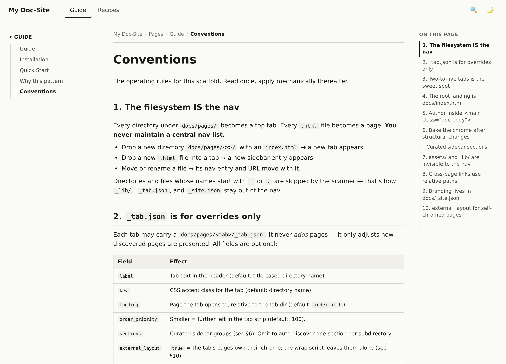
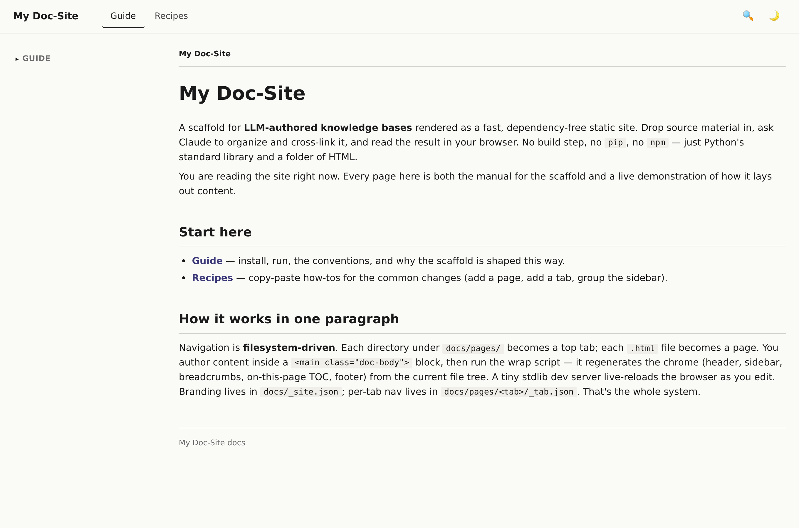
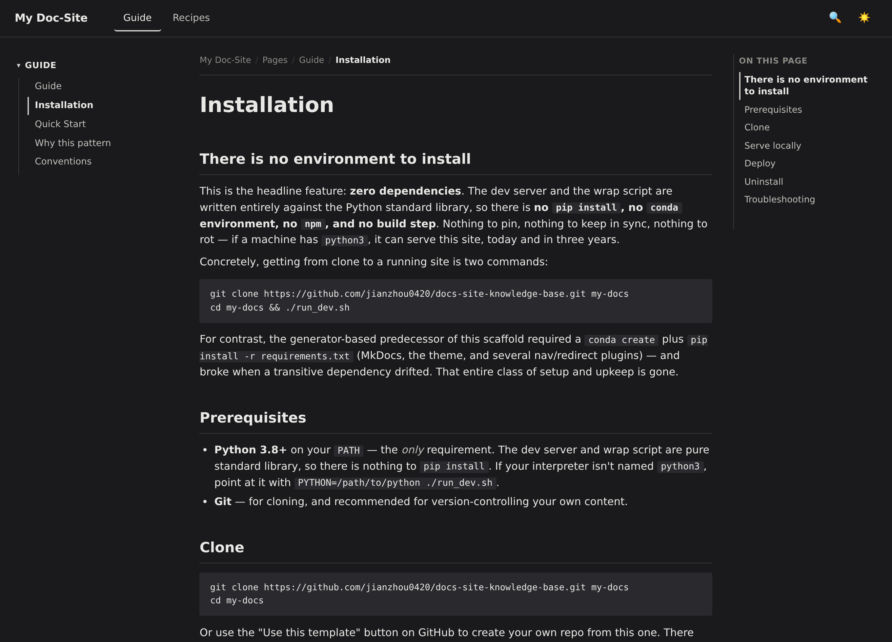
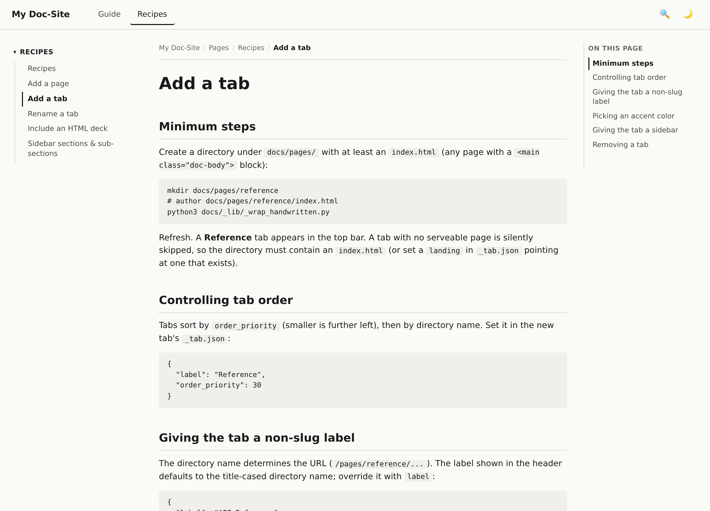
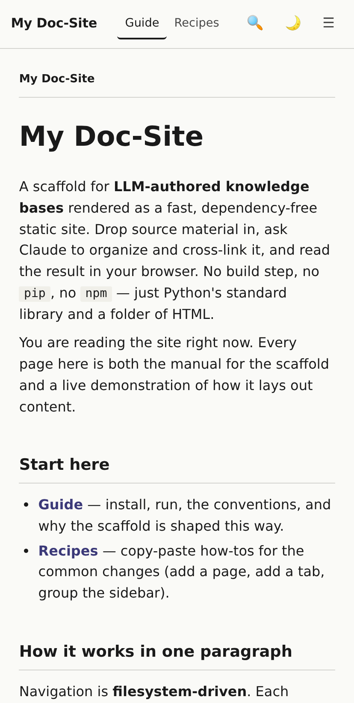
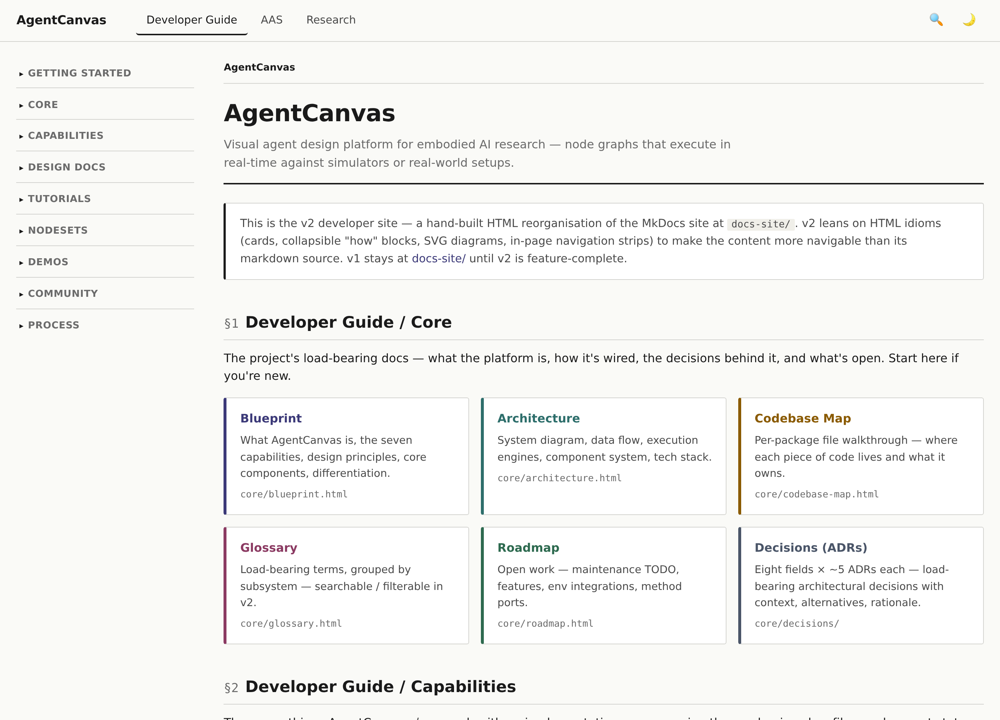

<h1 align="center">docs-site-knowledge-base</h1>

<p align="center">
  <strong>A zero-dependency static HTML doc-site for LLM-authored knowledge bases.</strong><br>
  Drop sources in → Claude organizes &amp; cross-links them → browse a fast, clean site.<br>
  No <code>pip</code>, no <code>npm</code>, no build step. If you have <code>python3</code>, you can run it.
</p>

<p align="center">
  
  
  
  
</p>

<p align="center">
  
</p>

---

## Why

You drop source material — papers, clippings, notes, code excerpts, experiment logs. You ask
Claude to organize, summarize, and cross-link it. The result is a browsable static site you
read locally and share.

The catch with most doc generators is the toolchain: a package set to install, a config to
learn, a build to run, and a dependency tree that rots between machines and over the years.
This scaffold takes the opposite bet — **the rendered HTML _is_ the source**, and the only
tooling is a few hundred lines of the Python standard library. It renders the same in three
years as it does today.

| Requirement of an LLM-authored KB | How this repo answers it |
|---|---|
| Additions shouldn't need a central-config edit | Nav is read from the filesystem. Claude creates `docs/pages/<tab>/<page>.html` → the page appears. |
| Reorganizing should be cheap | Move a folder → the nav re-routes. No central nav list to sync. |
| Content should stay portable & durable | Plain `.html`. No generator, no plugins, nothing to rot. |
| The author (Claude) needs the rules | Conventions live inside the rendered site, under **Guide**, for Claude to read on demand. |
| You want to *read* the result | Every page gets a header, sidebar, breadcrumbs, dark mode, and a right-hand TOC. |

## Looks like

<table>
  <tr>
    <td width="50%" align="center"><strong>Light</strong></td>
    <td width="50%" align="center"><strong>Dark</strong></td>
  </tr>
  <tr>
    <td></td>
    <td></td>
  </tr>
</table>

<table>
  <tr>
    <td width="62%"></td>
    <td width="38%" align="center"><br><em>Responsive — drawer nav on mobile</em></td>
  </tr>
</table>

## Real-world example

This scaffold isn't just a demo — it backs a real, ~210-page knowledge base.
**[AgentCanvas](https://jianzhou0420.github.io/AgentCanvas/)** is a visual agent-design
platform for embodied-AI research, and its entire doc-site — developer guide, design docs,
NodeSet reference, research notes and literature surveys — is built with this exact engine
and authored largely by Claude.

<p align="center">
  <a href="https://jianzhou0420.github.io/AgentCanvas/">
    
  </a>
</p>

[**Browse it live →**](https://jianzhou0420.github.io/AgentCanvas/) to see what a populated,
cross-linked KB feels like at scale — same filesystem-driven nav, same three-column layout,
hundreds of pages.

## Quick start

```bash
git clone https://github.com/jianzhou0420/docs-site-knowledge-base.git my-kb
cd my-kb
./run_dev.sh
# → http://0.0.0.0:8002
```

No environment to create, no dependencies to install. Edit a page and the browser
live-reloads. After adding, moving, or renaming pages, bake the chrome:

```bash
python3 docs/_lib/_wrap_handwritten.py
```

## How it works

- **`docs/pages/<dir>/`** — each directory is a top tab; each `.html` file is a page. (`_lib/_nav.py` scans this tree.)
- **Author content, not chrome** — you write a page's body inside a `<main class="doc-body">` block. The wrap script regenerates the header, sidebar, breadcrumbs, on-this-page TOC, and footer from the current file tree. It's idempotent.
- **`docs/_site.json`** — branding (site name, tagline, footer). **`docs/pages/<tab>/_tab.json`** — per-tab label, order, and sidebar grouping.
- **Live reload** — `_lib/_serve.py` is a stdlib HTTP server with mtime polling + Server-Sent Events; it pushes a browser reload when files change.

```
.
├── docs/
│   ├── index.html                 Root landing page
│   ├── _site.json                 Branding (site name, tagline, footer)
│   ├── _lib/                       The engine (Python stdlib only)
│   │   ├── _serve.py                 Live-reload dev server (HTTP + SSE)
│   │   ├── _layout.py                Shared HTML layout shell
│   │   ├── _nav.py                   Filesystem-driven tabs + sidebar
│   │   ├── _wrap_handwritten.py      Bakes chrome onto authored pages
│   │   └── _site.py                  Loads _site.json
│   ├── assets/                     style.css, nav.js, screenshots/
│   └── pages/
│       ├── guide/                  Install, quick-start, conventions, rationale
│       └── recipes/                Task how-tos (add a page/tab, group the sidebar)
└── run_dev.sh                      ./run_dev.sh → http://0.0.0.0:8002
```

The site shipped in `docs/` is **self-documenting** — it's both the manual for the scaffold
and a live demo of a filesystem-driven KB. Replace its content with yours as your KB grows.
Full conventions and worked recipes live under the **Guide** and **Recipes** tabs of the
rendered site.

## A typical session

1. Drop a source — a paper PDF, a clipping, a transcript — somewhere you can reach it.
2. Ask Claude to summarize it, write it up as an HTML page under `docs/pages/`, and link it to existing pages.
3. Claude runs the wrap script; you browse the result. Move files around if the organization isn't right.
4. When the KB is big enough, query Claude across it ("what have I learned about X?") and file the answer back as a new synthesized page.

The human rarely writes the wiki directly. The human drops material, asks questions, and reads.

## License

MIT. See [`LICENSE`](LICENSE).
